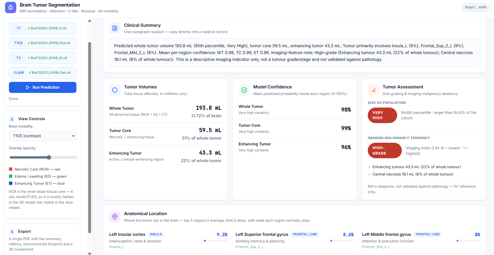
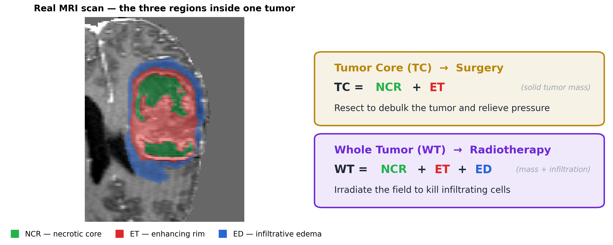
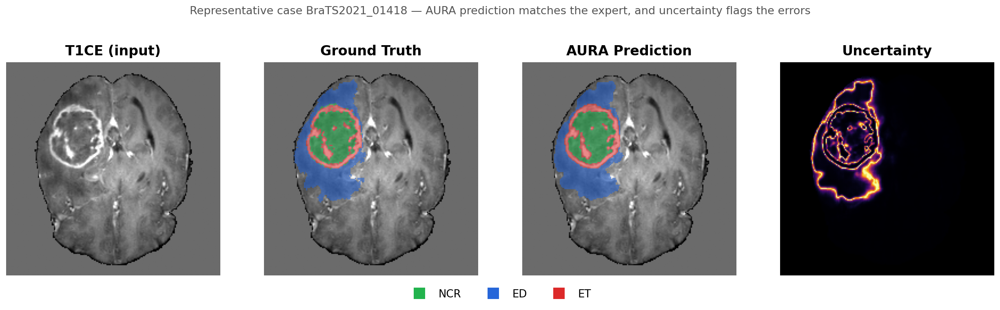
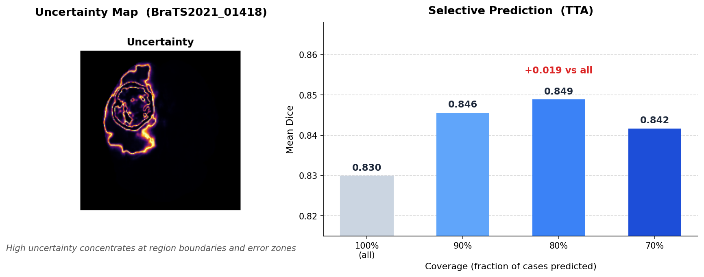

# AURA — 3D Brain Tumor Segmentation (BraTS 2021)

**National Taipei University, Department of Electrical Engineering**
System Engineering and Innovation Lab · Advisor: Dr. Basanta

Joshua Hsu (許豐有) · Jason Wu (吳東霖)

> **AURA** — *Attention · U-Net · Residual · All-modality*

AURA is an **originally designed, complete end-to-end medical-AI system — not just
a model**. Every stage, from raw multi-modal MRI to a deployed browser workstation,
is built, trained, and evaluated as one pipeline: a 3D CNN+transformer segmentation
network, a rigorous evaluation suite (accuracy + calibration + uncertainty), and an
interactive web tool that turns a scan into a clinical-ready report.

<p align="center">
  
</p>

The headline model reaches **0.839 mean Dice** (ET / TC / WT) on the held-out
BraTS-2021 validation split (251 cases), with the strongest **tumor-core** score and
best calibration/uncertainty of the three models studied — all in **45 M parameters
and ~0.24 s per scan** on a single consumer GPU.

> Academic capstone project. Trained and evaluated on the public
> [BraTS 2021](http://braintumorsegmentation.org/) dataset.

**Project documents:**
[Report](docs/PROJECT%20REPORT.pdf) ·
[Presentation](docs/PROJECT%20PRESENTATION.pdf) ·
[Poster](docs/PROJECT%20POSTER.pdf) ·
[Proposal](docs/PROJECT%20PROPOSAL.pdf)

---

## Contents

- [The problem & our solution](#the-problem--our-solution)
- [How the system works](#how-the-system-works)
  - [1. The clinical target](#1-the-clinical-target)
  - [2. Input & preprocessing](#2-input--preprocessing)
  - [3. The AURA model](#3-the-aura-model)
  - [4. Training](#4-training)
  - [5. Evaluation — beyond Dice](#5-evaluation--beyond-dice)
  - [6. Deployment — the web workstation](#6-deployment--the-web-workstation)
- [Results](#results)
- [Quickstart](#quickstart)
- [Repository layout](#repository-layout)
- [Installation · weights · data](#installation--weights--data)
- [Running it yourself](#running-it-yourself)
- [License & acknowledgements](#license--acknowledgements)

---

## The problem & our solution

Brain tumors are among the most lethal cancers in Taiwan — diagnoses keep climbing
(~750/year, ×3.2 over 40 years) while five-year survival sits near 30%. Accurate,
fast tumor delineation is the clearest lever on outcomes, but today it doesn't
scale.

**The problem**

- **Manual segmentation is slow** — outlining a tumor on MRI takes a radiologist
  *up to four hours per case*.
- **No instant 3D picture** — clinicians lack quick volumetric views and per-region
  volume metrics to plan surgery vs radiotherapy.
- **Demand outpaces specialists** — rising case numbers leave too few experts to
  read every scan in time.
- **Black-box AI isn't clinic-ready** — a prediction is only usable if the tool can
  also say *how sure it is* and flag the cases it is likely to get wrong.

**Our solution — AURA, an end-to-end system**

AURA addresses all four as **one pipeline**, not a standalone model:

| The problem | How AURA solves it |
|---|---|
| Hours of manual tracing | A 3D CNN+transformer model segments all three tumor regions in **~0.24 s/scan** |
| No 3D view or volumes | A browser **workstation** renders the case in 3D + tri-planar slices with instant per-region volumes |
| Too few specialists | A deployable, single-GPU tool (45 M params, 1.9 GB) that any clinic can run to **triage and assist** |
| Trust / black box | Built-in **uncertainty + calibration**, so the tool flags low-confidence cases for a second look |

The rest of this README walks the pipeline stage by stage — from raw MRI to the
deployed workstation.

---

## How the system works

### 1. The clinical target

A brain tumor is segmented into three nested regions, each driving a different
treatment decision. The model predicts 4 voxel classes
{background, NCR, ED, ET} and is scored over the nested regions **ET ⊂ TC ⊂ WT**.

<p align="center">
  
</p>

- **ET** (enhancing tumor) — active tumor.
- **TC** (tumor core, NCR + ET) — the solid mass that surgery resects.
- **WT** (whole tumor, + edema) — the field that radiotherapy targets.

### 2. Input & preprocessing

No single MRI sequence shows the whole tumor — T1CE highlights enhancing tumor,
FLAIR highlights edema, T1/T2 give anatomy. The system fuses all four into a
**5-channel** input (T1 · T1CE · T2 · FLAIR + a binary foreground mask),
z-scores each modality over brain voxels, and trains on **128³ patches** —
50% tumor-centered, 50% random — to fight a severe ~99:1 background-to-tumor
imbalance. Tumors span a 129× volume range and sit anywhere in the brain, so
there is no positional shortcut: training is patch-based and inference is
sliding-window.

### 3. The AURA model

A **CNN + transformer hybrid**: a residual-CNN encoder captures local texture, a
transformer at the **8³ bottleneck only** captures global 3D context (efficient and
fp16-stable), and a CNN decoder with 3-level deep supervision reconstructs the
segmentation. A 4-class softmax head avoids the region-overlap ambiguity of
sigmoid outputs, and decoder dropout doubles as an uncertainty source at inference.

<p align="center">
  
</p>

### 4. Training

Optimization is tuned for stability on imbalanced 3D segmentation: a **region-wise
Dice + Focal loss** over ET/TC/WT (Focal concentrates on hard, misclassified
voxels), deep supervision (full + ½ + ¼ resolution), Adam at lr 1e-4, effective
batch 32 (batch 2 × accum 16), mixed precision, EMA weights (decay 0.999), and
gradient clipping. Recipes are declared per-variant in
[`train_variant.py`](src/training/train_variant.py) so every model trains through
the same harness.

### 5. Evaluation — beyond Dice

AURA is judged on three axes, not just overlap:

| Axis | Metric | What it answers |
|---|---|---|
| **Segmentation** | Dice, HD95, NSD | How well does the prediction match the expert? |
| **Calibration** | ECE / ACE | Does its confidence match its accuracy on tumor voxels? |
| **Uncertainty** | AURC, risk–coverage | Does it know *when it is wrong*? |

Inference runs sliding-window with Gaussian importance weighting, plus 8-way
flip TTA and MC-Dropout for predictive uncertainty, and an ET post-processing
pass. Model-vs-model claims use **paired Wilcoxon tests + bootstrap 95% CIs** over
per-case metrics. A qualitative case below shows the prediction matching the
expert while the uncertainty map lights up exactly along the error-prone region
boundaries:

<p align="center">
  
</p>

That uncertainty is **actionable**: ranking cases by confidence and deferring the
least-confident 20% raises mean Dice from 0.830 to 0.849 — selective prediction
that a clinician can use to triage which scans need a second look.

<p align="center">
  
</p>

### 6. Deployment — the web workstation

The system ends in a tool, not a checkpoint. An interactive FastAPI +
[Niivue](https://niivue.github.io) workstation lets you upload a case, run the
deployed AURA model, explore the segmentation in 3D and on axial/coronal/sagittal
slices, read per-region volumes and confidence, and download a single PDF report —
including a per-inference GPU energy / CO₂ / cost estimate.

<p align="center">
  
</p>

**▶︎ Demo video** — upload → segment → 3D inspection → report, end to end:

https://github.com/user-attachments/assets/4c54dfef-1c2f-4ca6-84ed-8374faf5017f

It runs the **same** inference path as the offline evaluator (sliding-window →
softmax → ET post-process; no TTA/MC-Dropout, for latency), so what you see in the
browser matches the committed `baseline_post` metrics. A Traditional-Chinese
localization shares the same backend in [`web/web_zh/`](web/web_zh/).

---

## Results

BraTS-2021 validation split (251 cases), test-time augmentation + ET
post-processing (the `tta_post` mode). Dice is per region — **ET** / **TC** / **WT**.
Best per column in **bold**.

| Model | Mean Dice | Dice ET | Dice TC | Dice WT | HD95 ↓ | ECE ↓ | AURC ↓ |
|---|---|---|---|---|---|---|---|
| **baseline** (`base_cnn`) | 0.825 | 0.765 | 0.788 | 0.923 | 6.75 | 0.106 | 0.179 |
| **Complex** (`full`)      | 0.833 | **0.789** | 0.781 | **0.929** | **5.95** | 0.110 | 0.191 |
| **AURA** (`hybrid`)       | **0.839** | 0.785 | **0.804** | 0.928 | 5.96 | **0.100** | **0.175** |

**Efficiency** (single 128³ patch, consumer laptop GPU):
**45 M params · 612 GFLOPs · 1.9 GB peak · ~0.24 s/scan · 4.1 cases/s.**

**Less is more.** The three models share one residual-U-Net core. *Complex* stacks
**eight** added components (cross-modal attention, frequency branch, spectral-Swin,
uncertainty/boundary heads, multi-scale fusion); *AURA* adds just **one**
transformer bottleneck. AURA still wins on **mean Dice**, on the clinically
critical **tumor core** (+0.023 over Complex), and on **calibration + uncertainty** —
a clean negative result on stacking complexity, and the reason AURA is the model
deployed in the web app.

> Numbers are reproducible from the committed CSVs under [`results/`](results/).

---

## Quickstart

```bash
git clone <this-repo> && cd Brain_Tumor_Segmentation
pip install torch --index-url https://download.pytorch.org/whl/cu121
pip install -r src/requirements.txt

# Grab the AURA weights from the GitHub Releases page (see below) into
# logs/run_hybrid_<id>/best_model.pth, then launch the web workstation:
python scripts/prepare_webapp_assets.py
python -m uvicorn web.server:app --port 8000      # open http://localhost:8000
```

---

## Repository layout

```
src/
  configs/config.py          # all paths + hyperparameters
  model/
    registry.py              # the 3 variants — single source of truth
    model.py                 # ResUnet3D            (baseline)
    trans_resunet.py         # TransResUNet3D       (Complex)
    hybrid.py                # HybridUNet3D         (AURA)
    blocks/                  # per-component building blocks
  training/   train_variant.py · losses.py        # variant-aware trainer + losses
  evaluation/ evaluate_variant.py · _core.py · metrics.py · stats.py · ...
  preprocessing/ optimizing.py · dataset.py · gpu_augment.py
scripts/                     # tmux-wrapped pipelines (see scripts/README.md)
web/                         # FastAPI + Niivue workstation (pinned to AURA)
results/                     # committed validation metrics (CSV) + plots
docs/                        # report, slides, poster, figures
```

The three model names are a presentation layer; the registry keys
(`base_cnn` / `full` / `hybrid`) are the load-bearing identifiers for checkpoints
(`logs/run_<key>_*`) and results (`results/<key>/`). The single source of truth is
[`src/model/registry.py`](src/model/registry.py).

---

## Installation · weights · data

**Install.** PyTorch first from the CUDA-matched index, then the rest. Python 3.10+
and an NVIDIA GPU are recommended for training. `monai` is a hard dependency of
evaluation; `torchio` (robustness) and `fastapi`/`uvicorn` (web app) are optional.

```bash
pip install torch --index-url https://download.pytorch.org/whl/cu121
pip install -r src/requirements.txt
```

**Pretrained weights.** Checkpoints are too large for git and live on the
[**Releases**](https://github.com/Joshua-fy-Hsu/3D-Brain-Tumor-Segmentation/releases)
page (`v1.0`). Download an asset, rename to `best_model.pth`, place under a matching
run dir; the evaluator and web app auto-discover the newest checkpoint that matches
the requested variant (or pass `--checkpoint`).

| Release asset | Place as |
|---|---|
| `hybrid_best_model.pth`   | `logs/run_hybrid_<id>/best_model.pth`   (AURA — used by the web app) |
| `full_best_model.pth`     | `logs/run_full_<id>/best_model.pth`     (Complex) |
| `base_cnn_best_model.pth` | `logs/run_base_cnn_<id>/best_model.pth` (baseline) |

**Data.** This project uses **BraTS 2021** (T1, T1CE, T2, FLAIR + expert
segmentation), available from the
[official challenge page](http://braintumorsegmentation.org/) under its own terms —
it is **not** included here. Point the pipeline at your copy and preprocess:

```bash
export BRATS_DATA_PATH=/path/to/BraTS2021_Optimized   # or set in src/configs/config.py
python src/preprocessing/optimizing.py
```

---

## Running it yourself

```bash
# Train (recipes live in per-variant presets; the command just selects a variant)
python src/training/train_variant.py --variant hybrid --epochs 300

# Evaluate — single checkpoint, or snapshot-ensemble + extended TTA
python src/evaluation/evaluate_variant.py --variant hybrid --vmin-sweep
python src/evaluation/evaluate_variant.py --variant hybrid \
    --ensemble-ckpts "logs/run_hybrid_*/snapshot_top*.pth" \
    --tta-extended --vmin-sweep --overlap 0.625 --run-name eval_ensemble

# Compare two runs — paired Wilcoxon + bootstrap 95% CIs
python -m evaluation.stats compare \
    results/base_cnn/eval_X/per_case_metrics.csv \
    results/hybrid/eval_Y/per_case_metrics.csv \
    --mode tta_post --label-a baseline --label-b AURA

# Web workstation
python scripts/prepare_webapp_assets.py
python -m uvicorn web.server:app --host 0.0.0.0 --port 8000
```

See [`scripts/README.md`](scripts/README.md) for the full command reference and
[`web/README.md`](web/README.md) for the API.

---

## License & acknowledgements

Code is released under the [MIT License](LICENSE).

- Data: [BraTS 2021](http://braintumorsegmentation.org/) (RSNA-ASNR-MICCAI) —
  subject to the dataset's own license; not redistributed here. Pretrained weights
  derived from it remain subject to the dataset's terms.
- Built with [PyTorch](https://pytorch.org), [MONAI](https://monai.io), and
  [Niivue](https://niivue.github.io).
</content>
</invoke>
